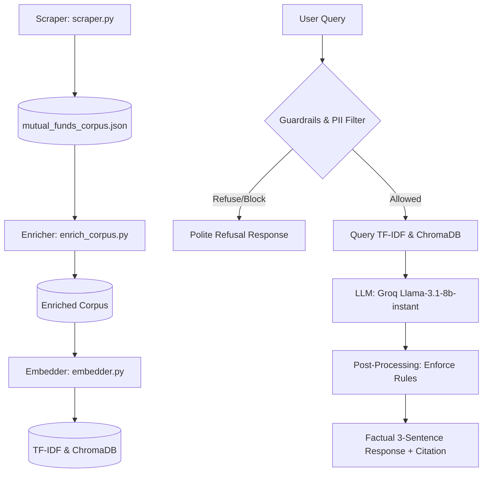

# Mutual Fund FAQ Assistant (Facts-Only Q&A Chatbot)

A premium, strict, facts-only RAG chatbot designed to answer questions about 5 specific ICICI Prudential mutual fund schemes using scraped Groww data.

## System Architecture



1. **Scraper & Parser (`scraper.py`)**: Crawls specified Groww fund URLs, strips HTML markup, cleans boilerplate noise, and overrides naming mismatches (e.g. mapping the old Balanced URL slug to its current problem-statement-compliant name: "ICICI Prudential Balanced Advantage Fund Direct Growth").
2. **API Data Enricher (`enrich_corpus.py`)**: Enriches scraped texts with key numerical figures (e.g. expense ratios, exit loads, SIP minimums, fund managers, lock-in periods) fetched from Groww's internal web API.
3. **Chunking & Indexing (`chunker.py`, `embedder.py`)**: Segments documents into section-aware chunks and indexes them using TF-IDF vectors in ChromaDB.
4. **Intent Classifier & PII Guardrails (`guardrails.py`)**: Intercepts advisory queries ("should I invest?", "which is better?") and personal information identifiers (Aadhaar, PAN, email, phone) prior to database query.
5. **RAG Pipeline & Post-Processing (`rag_pipeline.py`)**: Retrieves matching context, checks against a strict similarity threshold, queries Groq API (Llama-3.1-8b-instant), and programmatically post-processes the output to guarantee a maximum 3-sentence limit, include a single hyperlinked citation, and omit dates/times.

---

## Getting Started

### 1. Prerequisites
- Python 3.9+ installed on Windows.
- A valid **Groq API Key**.

### 2. Installation
Clone the repository and install the dependencies:
```bash
pip install -r backend/requirements.txt
```

Create a `.env` file at the root of the workspace:
```text
GROQ_API_KEY=your_actual_groq_api_key_here
```

### 3. Running the Data Pipeline (Optional)
If you wish to scrape and index the data fresh:
```bash
python backend/scraper.py
python backend/enrich_corpus.py
python backend/embedder.py
```

### 4. Running the Scheduler (Daily at 10:00 AM IST)
The ingestion pipeline is automated via `backend/scheduler.py` to run daily at 10:00 AM IST.

To run the scheduler in the background:
```bash
python backend/scheduler.py
```

To run a single execution of the pipeline immediately and exit:
```bash
python backend/scheduler.py --run-now
```

### 5. Running the Application
To start the FastAPI backend server (which also hosts the frontend UI):
```bash
python backend/app.py
```
Open **[http://127.0.0.1:8080](http://127.0.0.1:8080)** in your browser to interact with the premium chat interface.

---

## Running Verification Tests

To verify correctness, advisory safety, PII protection, and out-of-scope refusal handling:

```bash
# Run guardrails tests
python backend/test_guardrails.py

# Run RAG integration tests
python backend/test_rag.py

# Run factual accuracy tests
python backend/test_accuracy.py

# Run safety & adversarial tests
python backend/test_adversarial.py
```
