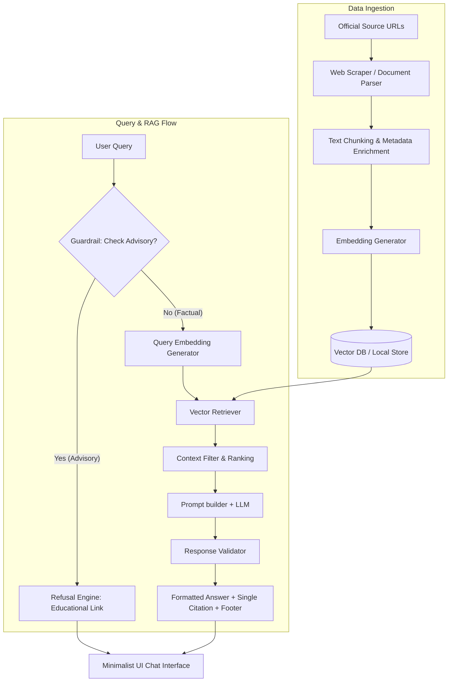

# System Architecture: Mutual Fund FAQ Assistant (Facts-Only Q&A)

This document outlines the architecture for the **Mutual Fund FAQ Assistant**, a facts-only Q&A system built using a Retrieval-Augmented Generation (RAG) approach. The system is designed to provide objective, verifiable information regarding mutual funds while strictly adhering to safety and regulatory compliance (no advisory, no investment recommendations).

---

## 1. Architectural Overview

The system uses a modular, lightweight RAG architecture consisting of four core components:
1. **Data Ingestion & Corpus Processor**: Handles scraping, parsing, and chunking of official mutual fund documents/pages.
2. **Knowledge Base & Vector Store**: Stores processed chunks along with embeddings and metadata (source URL, update date).
3. **Retrieval & Query Processor**: Performs semantic search and retrieves context relevant to the user's query.
4. **LLM Generation with Guardrails**: Generates a facts-only response constrained strictly to retrieved context, with fallback refusal mechanisms for advisory/opinionated queries.
5. **User Interface**: A simple, clean web interface showcasing the disclaimer, example queries, and conversational interface.



---

## 2. Component Breakdown

### 2.1. Data Ingestion & Corpus Processor
* **Scraper/Parser**: Extracts textual content from selected official AMC URLs (e.g., ICICI Prudential Growth Schemes, SID, KIM, FAQs).
* **Chunking Strategy**: Employs semantic chunking or recursive text splitting to maintain readability of financial figures, fee structures, and exit loads.
* **Metadata Association**: Each chunk is tagged with its source URL and retrieval timestamp:
  ```json
  {
    "text": "The exit load for ICICI Prudential Bluechip Fund is 1% if redeemed within 1 year...",
    "metadata": {
      "source_url": "https://groww.in/mutual-funds/icici-prudential-large-cap-fund-direct-growth",
      "last_updated": "2026-06-11"
    }
  }
  ```

### 2.2. Vector Storage & Retrieval
* **Vector Database**: A lightweight database (e.g., ChromaDB, FAISS, or simple JSON-based vector index) is used for local deployment.
* **Retrieval Strategy**: 
  * Computes cosine similarity between user query embedding and document chunks.
  * Filters and selects top-$K$ chunks with highest confidence scores.
  * If the similarity score is below a predefined threshold, the query is treated as "out of knowledge base" to prevent hallucination.

### 2.3. RAG & LLM Prompting
* **System Prompt Guardrails**: The LLM is instructed with strict guidelines:
  * Do NOT offer opinions or advice (e.g., "Should I buy?", "Which is better?").
  * Max 3 sentences.
  * Provide exactly one citation link from the retrieved chunks.
  * Cite the exact URL matching the facts retrieved.
* **Out-of-Distribution/Refusal Handling**:
  * For advisory queries, the system redirects to a friendly refusal response:
    > *"I cannot provide investment advice or recommendations. You can learn more about mutual fund guidelines on the [AMFI Website](https://www.amfiindia.com) or [SEBI Website](https://www.sebi.gov.in)."*
  * For queries out of the knowledge base, a polite "information not available" message is returned without citation links.

---

## 3. Detailed Data Flow

1. **User Query Input**: The user asks, *"What is the exit load for ICICI Prudential Large Cap Fund?"*
2. **Intent Classification**: The query is validated against refusal conditions (opinion/recommendation detection).
3. **Retrieval**:
   * Semantic embedding of the query is generated.
   * Nearest neighbors matching the scheme are queried from the Vector Store.
4. **Context Synthesis**: Context block is generated along with source URL.
5. **Generation**: LLM produces the final output based *only* on the context block.
6. **Formatting**: The interface prints:
   * The response (Max 3 sentences).
   * Hyperlink to the source URL.
   * Last updated date.

---

## 4. Privacy, Security & Compliance

* **Data Minimization**: Absolutely no collection of personally identifiable information (PII) such as PAN, Aadhaar, Account Numbers, OTPs, or contact details.
* **Strict Factuality**: The assistant prioritizes accuracy over conversational intelligence. Hallucinations are actively suppressed by enforcing zero-shot generation on local context only.
* **Disclaimer Visibility**: The UI permanently displays: `"Facts-only. No investment advice."`
